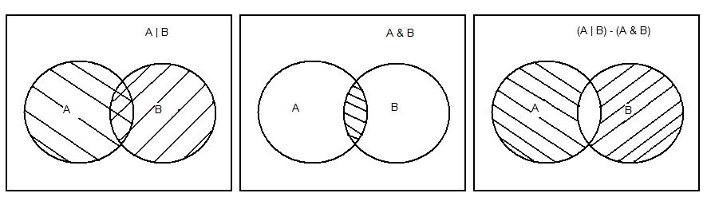
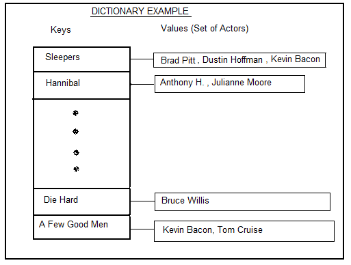

# Movies & Actors

## Assignment Overview

The purpose of this project is to work on dictionaries, sets, and functions.

**Task**
1. Given 2 the unique titles of a movie, each representing the set of actors in that movie:
    - Find all the actors in those movies (A union B). This is also represented as the | operator (A | B)
    - Find the common actors in the 2 movies. (A intersection B). This is also represented as the & operator (A & B)
    - Find the actors who are in either of the movies but not both (A symmetric_difference B), also called exclusive or. This is also represented as the ^ operator (A^B)

    

2. Given an actor’s name, find all the actors with whom he/she has acted. i.e. find all the co-actors of the given actor

## Background
Websites like IMDB (which stands for Internet Movie DataBase) maintain all the info about movies, the actors etc. If you search for a movie on the website, a web page showing information about the movie is displayed. It also shows all the actors in it. If you click on the hypertext link for an actor, you are taken to the actor’s web page and can find all the info about him/her. i.e. names of movies in which the actor has acted, some other info.  This assignment should give you some insight into the working of such websites.

## Data Structure
What is an appropriate data structure for this assignment? Movie names are unique and our aim is to find the actors in the movies subject to some criteria (&, | or ^ ). 
In a dictionary, the keys are unique. So, that would make a good choice in this case?
Using the movies.txt file, create a dictionary with keys as the **Movie Names** and the value as the **“set of actors”**. A list could also be used instead of a set here, but then you would have to implement the union, intersection and other set operations all by yourself (**If you want, you can try that!**); operations that are provided with the **set** data structure. 

## Program Specifications
Provided to you is a file called “Movies.txt” in which each line is of the form:
*Name of Actor, Movie1, Movie2, Movie3….*

High Level Algorithm
1. Read in the lines from the “movies.txt” file.
2. For each line:
    - If the movie name has not already been entered into the dictionary, add it as a key, and store the name of the actor as a value.
    - If the movie name exists in the dictionary, add the actors name to the set of actors .i.e. to the value in the dictionary.
    The dictionary is now ready.
3. Show a menu to the user and allow him to choose an option amongst:
    - Give me 2 movies separated by ( &, | , ^)
    - Give me name of an actor and find his/her co-actors
4. If the user goes for option (a) above, prompt him/her for the names of the 2 movies separated by ( &, | , ^). Perform the corresponding set operations and display the result.
5. If the user selects option (b) above, prompt for the name of the actor. Show the results indicating names of the co-actors.
6. End

*Remember that you have to use functions in this project (at least 2 of them); more would be appreciated. Eg. Building a dictionary, finding co-actors etc. each could be represented by a function. Bottom line is that “Try to use functions wherever possible” as they carry points.*

## Assignment Notes
1. Some of the set operations that are needed in this project are union, intersection and symmetric_difference.
2. The add () method of sets can be used to add actors to movie set in dictionary.
3. In order to find the co-actors, you will have to iterate over the dictionary and perform a set membership operation. The keyword “in” should be useful.
